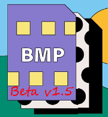

# __24-bit Bmp File Manipulation Project__ 

##### This project is made without any libraries except the STD C++17 libs , yes it was a journey!  from learning to deal with hex dump and .bin files to image processing and then gui using QT(soon)💙.

> ### 📣 Beta (v1.5) is out!
 * now can thershhold an image 
 * now can grayscale an image 
 * ~~some bugs fixed~~
 
 

 
 

> ###  🛠 Issues &  Notes:

* if using lib *`"filesystem"`* produces errors please try newer cpp compiler version or replace it with [ghc/filesystem](https://github.com/gulrak/filesystem/releases) and replace all instances to *`ghc::filesystem`*
  -   _**as far as i know**_ : this happends due to *stdc++* not supporting this lib for versions older than *C++17*. 
  *  replacing with `ghc/filesystem` is straight forward :  **download -> then -> `#include "abs-path-to-ghc/filesystem.h"`** . 

* Due to some Dependency/dynamic linking issues i provided a static linked .exe  to use. This will work almost for all platforms
  - [cross_platform_bmp_betav1.5.exe](https://github.com/orsnaro/Static_chroma_bmp/blob/master/cross_platform_bmp_betav1.5.exe) .
  *  to produce it when compiling my source code use command `g++ main.cpp -o chorma_proj.exe -static-libstdc++` .

 
 
 
 
 
 
 
 

> ##### 🧾 References: 
  
1. [learn the  bmp](https://www.drdobbs.com/architecture-and-design/the-bmp-file-format-part-1/184409517)
2. [24-bit BMP Structure](https://upload.wikimedia.org/wikipedia/commons/7/75/BMPfileFormat.svg)
3. [From purdue college](https://engineering.purdue.edu/ece264/17au/hw/HW15)
4. [#Pragma Pack() world](https://learn.microsoft.com/en-us/cpp/preprocessor/pack?view=msvc-170)
5. [Binary file stream C++](https://www.eecs.umich.edu/courses/eecs380/HANDOUTS/cppBinaryFileIO-2.html)
6. [more RAWS!](https://cplusplus.com/articles/DzywvCM9/)
7. [On Image processing](https://web.stanford.edu/class/ee368/handouts.html)

At full release this repo will be a mini-gui-application on (file streaming in cpp  + image manipulation)  , Note : I know it's much easier in e.g.(python). but I need it.   its  mainly for  educational purposes . [Compiler used for __beta v1.5__ : gcc version 12.1.0 (MinGW-W64 x86_64-ucrt-posix-seh] 
